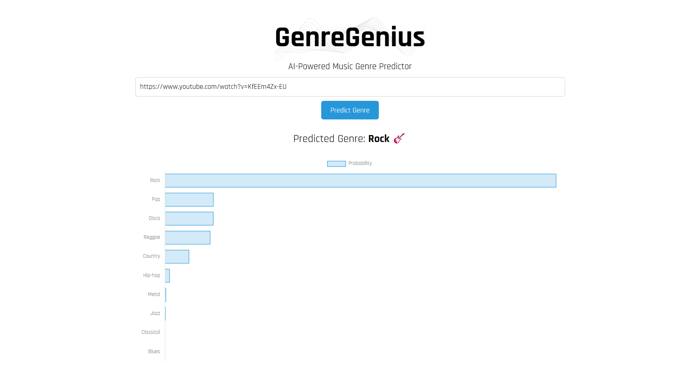

# GenreGenius

Full-stack web application that predicts the genre of a song uploaded as a YouTube URL using a PyTorch neural network classification model trained on the GTZAN dataset.

## Setup Instructions

**Prerequisites**

The following must be installed prior to running the application:

- Python (including venv module)
- Node.js
- pip

**Running the Application**

1. Clone the repository: https://github.com/ngburgess/GenreGenius.git
2. Set executable permissions: "chmod -x run.sh"
3. Run the shell script: "./run.sh"
4. Access the app: http://localhost:3000
5. Stop the app: CTRL + C
